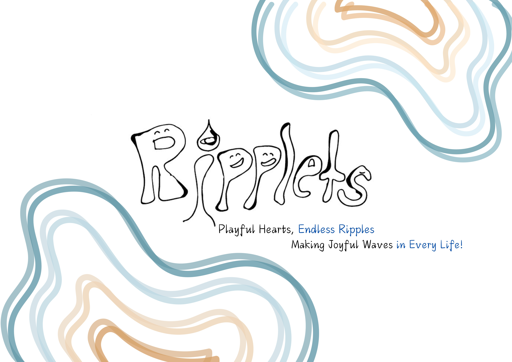

## Willkommen bei Ripplets
Spielerisch die Welt entdecken!

Bei Ripplets dreht sich alles um gemeinsames Spielen, Entdecken und Lernen!
Unsere liebevoll gestalteten Spielkreise bieten Kindern die Möglichkeit, in einer sicheren und fröhlichen Umgebung neue Freundschaften zu schließen, kreativ zu sein und spielerisch ihre Sprachfähigkeiten zu entwickeln.
Wir bieten Spielkreise in Deutsch und Englisch an – an zwei verschiedenen Standorten.
Unsere erfahrenen Betreuer:innen begleiten die Kinder mit altersgerechten Aktivitäten, Liedern, Geschichten und Spielen, die auf die jeweilige Sprache abgestimmt sind.
Ob Ihr Kind erste soziale Erfahrungen sammeln, eine neue Sprache kennenlernen oder einfach nur Spaß haben möchte – bei Ripplets ist jedes Kind herzlich willkommen!
Entdecken Sie unser Angebot und lassen Sie Ihr Kind Teil einer fröhlichen und inspirierenden Gemeinschaft werden.

Wir freuen uns darauf, Sie und Ihr Kind bei Ripplets willkommen zu heißen!

## Veranstaltungsort 1
📍 Gewächshaus Kassel

📆 Spielzeiten: [Details zu den Terminen]

## Veranstaltungsort 2
📍 Evangelisches Gemeindehaus Harleshausen

📆 Spielzeiten: [Details zu den Terminen]

<form
  action="https://formspree.io/f/mzzdvwpd"
  method="POST"
>
  <label>
    Deine E-Mail/Your email:
     
    <input type="email" name="email">
   
      
    <label for="full-name">Vor- und Nachname/Full Name</label>
     
    <input type="text" name="name" id="full-name" placeholder="First and Last" required="">
   
   
    <label>
    Bitte wähle den Kurs aus, für den du dich registrieren möchtest:/
          
    Please select the course you want to register for:
      
    <input type="checkbox" name="EKDE1401" value="yes">
    Deutsch 14:00-15:00 (1-2 Jahre)
 </label>
      
    <label>
    <input type="checkbox" name="EKDE1502" value="yes"> 
    Deutsch 15:00-16:00 (2-3 Jahre)
 </label>
     
    <label>
    <input type="checkbox" name="GHEN1503" value="yes"> 
    English 15:00-16:00 (1-3 Years)
 </label>
       
      
    <label>
    Zusatzinformationen/Additional information:
       
      <textarea name="message"></textarea>
  </label>
  <!-- your other form fields go here -->
        
    <button type="submit">Send</button>
